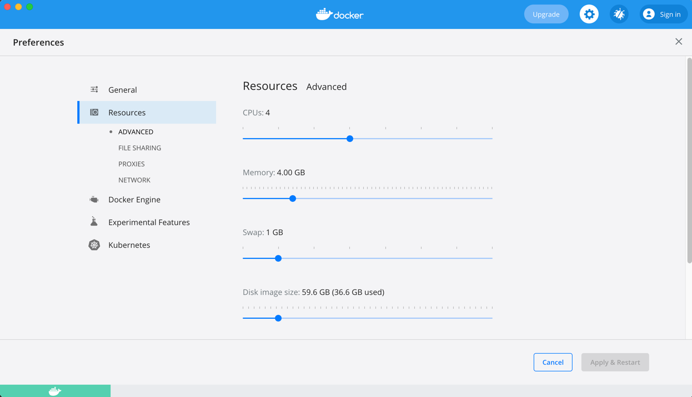

# Ambiente de Desarrollo

Este proyecto tiene como fin desplegar un ambiente de desarrollo construido usando docker y docker-compose. Este ambiente podrá ser usado localmente, para correr pipelines que verifiquen los proyectos antes de subirlos a github.

Los siguientes son los servicios desplegados:

1. [Jenkins](https://www.jenkins.io/). Servidor de CI.
2. [SonarQube](https://www.sonarqube.org/). Plataforma para realizar análisis estático de código.

## Preparar el Ambiente

Antes de realizar el despliegue de los servicios, es necesario configurar el ambiente local.

1. [Instalar docker](https://docs.docker.com/docker-for-mac/install/)
2. Configurar al menos 4GB para el proceso de docker
   
   

## Configurar las variables de enterno

Antes de realizar el despliegue de los servicios, es necesario configurar las variables de entorno definidas en el archivo [.env](.env).

- **JENKINS_HTTP_PORT:** Puerto al que se podrá acceder a Jenkins por HTTP.
- **JENKINS_HTTPS_PORT:** Puerto al que se podrá acceder a Jenkins por HTTPS.
- **SONAR_HTTP_PORT:** Puerto al que se podrá acceder a Sonarqube.
- **CODE_FOLDER:** Carpeta local en la que se encuentra el workspace con el código fuente de los proyectos.

## Despliegue

Los servicios se desplegarán usando [docker-compose](https://docs.docker.com/compose/).

1. Usando el terminal, desplazarse hasta esta carpeta.
2. levantar los servicios con el comando:

    ```shell
    docker-compose up -d
    ```

## Configuración de Sonar

Una vez los servicios se hayan desplegado, se deben seguir los siguientes pasos para configurar Sonar:

1. En un navegador, ingresar a la url http://localhost:9000 (reemplazar el puerto por el configurado en el archivo [.env](.env)).
2. Ingresar con los datos por defecto **admin/admin**.
3. Configurar una nueva contraseña.
4. Una vez dentro de la consola de Sonar, ir a la sección "Administration".
5. Dentro de menú "Security", buscar la opción "Users".
6. En el listado, buscar el usuario "Administrator", y dar clic en la opción "Update Tokens".
7. Escribir "Jenkins" en el nombre del token y dar clic en "Generate".
8. Copiar el token para usarlo más adelante.

## Configuración de Jenkins

Antes de configurar algún pipeline en Jenkins es necesario realizar las siguientes configuraciones:

1. En un navegador, ingresar a la url http://localhost:9090 (reemplazar el puerto por el configurado en el archivo [.env](.env)).
2. Obtener el password del admin, usando el siguiente comando:
   
   ```shell
   docker exec dev-tools_jenkins_1 cat /var/jenkins_home/secrets/initialAdminPassword      
   ```
3. Copiar el password en el campo correspondiente en el navegador.
4. Seleccionar "Install suggested plugins"
5. Crear una cuenta administradora.
6. En el siguiente paso dejar la url por defecto y finalizar la configuración.
7. Una vez reiniciado Jenkins, ir a la sección "Administrar Jenkins".
8. Ir a la sección "Administrar Plugins".
9. Dar clic en el tab "Todos los plugins".
10. En el buscador, escribir "docker", y luego seleccionar los plugins "Docker" y "Docker Pipeline".
11. En el buscador, escribir "sonar", y luego seleccionar los plugins "SonarQube Scanner" y "Sonar Quality Gates".
12. Dar clic en "Install without restart".
13. Luego de instalar los plugins, es recomendable actualizar los demás plugins instalados. Esto se puede hacer desde la misma pantalla de "Gestor de Plugins".
14. Luego de realizar las instalaciones es necesario configurar Sonar. Para esto, es necesario ir a la sección "Administrar Jenkins" y luego "Configurar el Sistema".
15. En la sección "SonarQube Servers", dar clic en "Add SonarQube".
16. En el nombre escribir **SonarQube**. En la url poner **http://sonar:9000**.
17. En la opción "Server authentication token", dar clic en "Add" y luego "jenkins".
18. En la opción "Kind" seleccionar "Secret Text".
19. En el secret poner el token creado en la configuración de sonar. En el id poner "sonar". Luego, clic en "Add" y seleccionar el token de la lista.
20. Guardar la configuración.


## Configuración Agente de Construcción en Jenkins

Antes de realizar la ejecución del pipeline en Jenkins, es necesario construir el agente con el cual se realizarán las construcciones. Para esto se deben seguir estos pasos:

1. En el terminal, ir a la carpeta "slave", de este proyecto.
2. Construir la imagen, usando el siguiente comando:
   ```shell
   docker build -t gradle-agent .
   ```

## Crear un pipeline con Jenkins

Para probar el despliegue se creará un pipeline de un proyecto. Para esto seguir estos pasos:

1. Entrar a Jenkins.
2. Dar clic en "Nueva Tarea".
3. Poner un nombre a la tarea y seleccionar "Pipeline".
4. Al final de formulario, en la sección de "Pipeline", seleccionar "Pipeline script", y en el script pegar el contendio del archivo [Jenkinsfile.template](Jenkinsfile.template)
5. Reemplazar la variable **PROJECT_NAME** por el nombre del proyecto a construir. Este debe ser el nombre de la carpeta en el workspace.
6. Dar clic en "Guardar".
7. En las opciones de la izquierda, dar clic en "Construir ahora".
